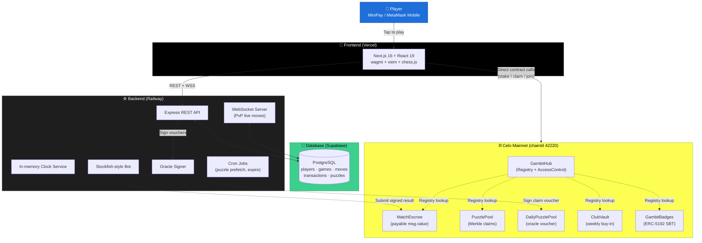
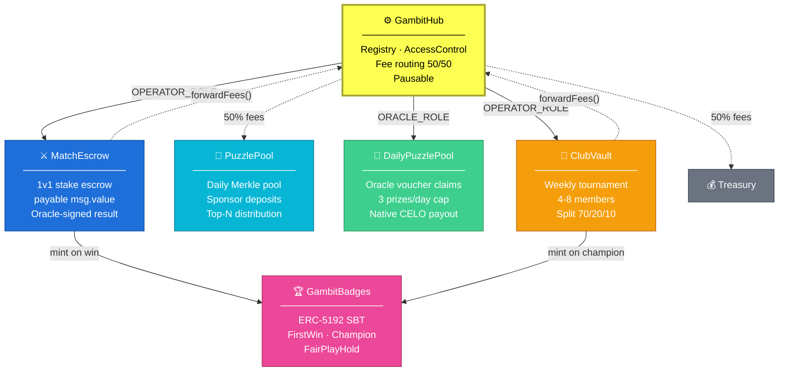
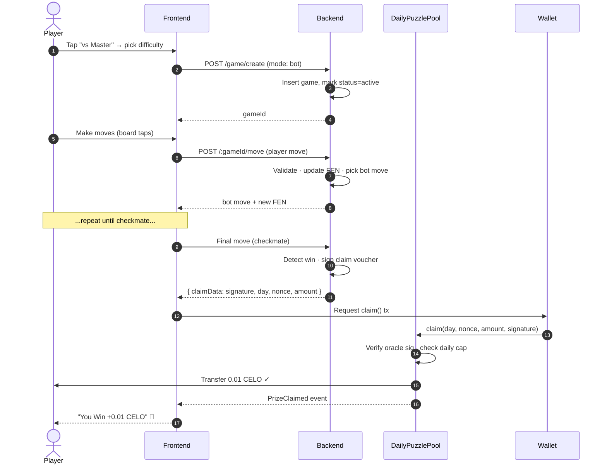
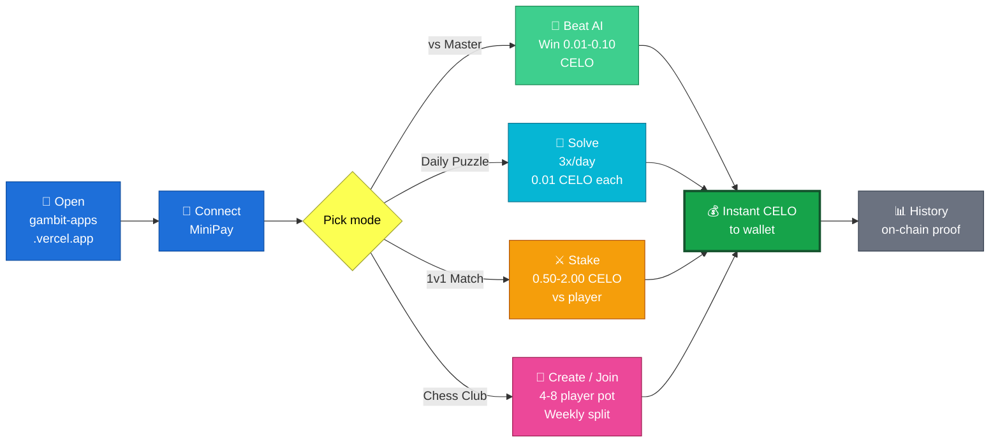
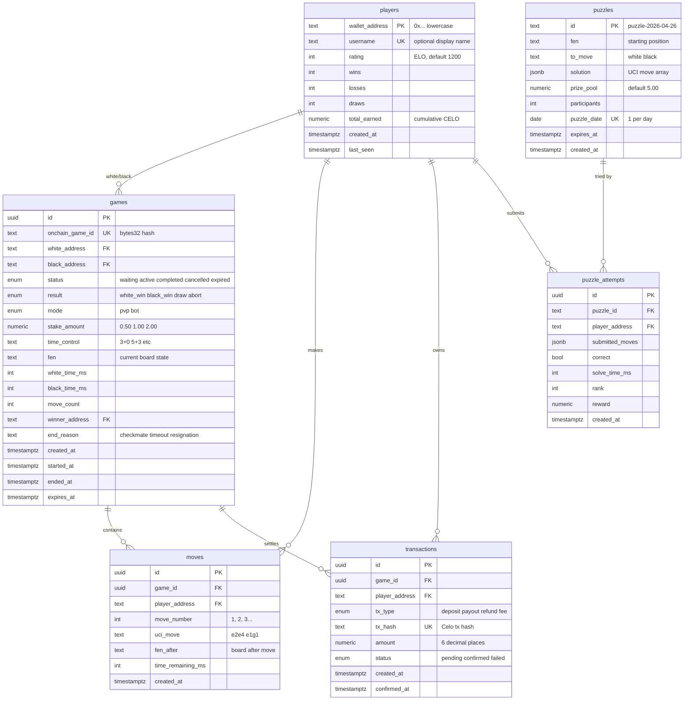

<div align="center">

# ♟ Gambit

**Chess that pays you in CELO.**

A mobile-first chess MiniApp on **Celo Mainnet** — built for **MiniPay**'s 14M+ users in emerging markets.
Beat the AI, solve daily puzzles, stake against players, or run weekly clubs — every win settles instantly on-chain in **native CELO**.

[](https://gambit-apps.vercel.app)
[](https://celo.org)
[](https://minipay.to)
[](./LICENSE)

[**Try it now →**](https://gambit-apps.vercel.app)

</div>

---

## 📖 Overview

Chess has 600M+ players worldwide. None of them get paid. Gambit changes that.

Gambit reimagines chess as a **microearning surface** for the next billion onchain users. Stakes are sized for Lagos, Nairobi, Manila, and Jakarta — not San Francisco. Every payout is instant, on-chain, and denominated in native CELO. No bridges, no approvals on the main flow, no hidden fees.

Built for [Celo Proof of Ship Season 2](https://talent.app).

---

## 🚀 Live Deployment

| Layer | URL |
|---|---|
| **Frontend** | https://gambit-apps.vercel.app |
| **Backend API** | https://be-gambit.up.railway.app |
| **Chain** | Celo Mainnet (chainId `42220`) |

### Verified Smart Contracts (Celo Mainnet)

| Contract | Address | Explorer |
|---|---|---|
| **GambitHub** | `0x992DA8B79158F269513EF27675035c585d07B047` | [view](https://celoscan.io/address/0x992DA8B79158F269513EF27675035c585d07B047) |
| **MatchEscrow** | `0x27ec815b4022Fb34a3e78DdCC1b8e62406c556fc` | [view](https://celoscan.io/address/0x27ec815b4022Fb34a3e78DdCC1b8e62406c556fc) |
| **PuzzlePool** | `0x3B9A1A0d6ab2AB846661Ee0F5a1DB93EEc134054` | [view](https://celoscan.io/address/0x3B9A1A0d6ab2AB846661Ee0F5a1DB93EEc134054) |
| **DailyPuzzlePool** | `0x859D1b6e685b8763ceDa79B17fB3aF7E2A4958e8` | [view](https://celoscan.io/address/0x859D1b6e685b8763ceDa79B17fB3aF7E2A4958e8) |
| **ClubVault** | `0x08cb38f973E5f964e8662624660b3F3442337079` | [view](https://celoscan.io/address/0x08cb38f973E5f964e8662624660b3F3442337079) |
| **GambitBadges** | `0x7F554B60cC46198213e57f2C667d83ef480981C3` | [view](https://celoscan.io/address/0x7F554B60cC46198213e57f2C667d83ef480981C3) |

All 6 contracts are verified on Celoscan. Source code in [`sc_celo_gambit/`](./sc_celo_gambit).

---

## 🎮 Game Modes

| Mode | Description | Token |
|---|---|---|
| **vs Master** | Single-player against the AI bot at 3 difficulty levels (Easy, Medium, Hard). Prizes scale: 0.01 / 0.05 / 0.10 CELO. | Native CELO |
| **Daily Puzzle** | One puzzle per day. Solve correctly on the first try → win 0.01 CELO. Up to 3 prizes per day per wallet. **Practice mode** unlocks after limit. | Native CELO |
| **1v1 Match** | Stake 0.50 / 1.00 / 2.00 CELO against another player. Winner takes pot minus 3% protocol fee. Time controls: 1+0, 3+0, 3+2, 5+3. | Native CELO via `msg.value` |
| **Chess Club** | Create or join a 4–8 member weekly tournament. Pot splits 70 / 20 / 10. The 10% rolls into next week's pot. Buy-in via approve+transferFrom. | CELO ERC20 wrapper |
| **Soulbound Badges** | ERC-5192 milestones — `FirstWin`, `PuzzleStreak7`, `ClubChampion`, `Rating1400`, `FairPlayHold`. | — |

---

## 🏗 Architecture

### System Overview



### Smart Contract Relationships



### Sequence — vs Master Win + Claim



### User Journey



### Database Schema (Supabase / PostgreSQL)



**Schema notes:**
- `players.wallet_address` is the **primary key** (not UUID) — wallets are first-class identity
- `games.mode = 'bot'` means single-player vs AI — no on-chain escrow, only off-chain game record
- `transactions.tx_type = 'payout'` is created as `pending` when oracle signs voucher → marked `confirmed` when on-chain claim succeeds
- `puzzle_attempts (puzzle_id, player_address)` has a **UNIQUE constraint** — one attempt per puzzle per player
- Realtime publication enabled on `games` and `moves` for live PvP UI updates
- All writes use Supabase **service_role key** (BE only); FE reads via **anon key** with RLS protection

### Why off-chain game logic?

A 40-move chess game on-chain would cost more in gas than the stake itself. Following the online poker pattern: **game logic off-chain, money on-chain**. The backend signs match results with a dedicated oracle key whose address holds `ORACLE_ROLE` on `GambitHub` — contracts only release funds when the signature verifies.

---

## 🛠 Tech Stack

| Layer | Stack |
|---|---|
| **Smart Contracts** | Solidity 0.8.24, Foundry, OpenZeppelin (AccessControl, ReentrancyGuard, Pausable, ERC-5192) |
| **Frontend** | Next.js 16 (App Router), React 19, wagmi 2, viem 2, chess.js, Tailwind CSS |
| **Backend** | Node.js 20, Express 5, viem 2, ws (WebSocket), node-cron, Supabase JS client |
| **Database** | Supabase (Postgres) with RLS |
| **Chain** | Celo Mainnet · `chainId 42220` · `https://forno.celo.org` |
| **Token** | Native CELO via its dual-interface ERC20 wrapper at `0x471EcE3750Da237f93B8E339c536989b8978a438` |
| **Bot Engine** | chess.js with depth-based heuristics (captures, checks, checkmates) |
| **Hosting** | Frontend on Vercel · Backend on Railway · Contracts on Celo Mainnet |

---

## 📁 Repository Structure

```
celo_hackaton2/
├── frontend/              # Next.js MiniApp (player-facing UI)
│   ├── app/               # App router pages (home, vs-master, puzzle, play, lobby, club, history, profile)
│   ├── components/        # Chessboard, toast, bottom-nav, icons
│   ├── hooks/             # use-wallet, use-session, use-match-escrow, use-club-vault, ...
│   ├── lib/               # contracts.ts, format.ts, errors.ts, wagmi.ts
│   └── public/            # logo + static assets
│
├── Gambit-BE/             # Backend API server
│   ├── src/
│   │   ├── routes/        # auth, game, puzzle, leaderboard, player
│   │   ├── services/      # gameService, clockService, escrowService, puzzleService, ...
│   │   ├── ws/            # WebSocket server + game rooms
│   │   ├── middleware/    # JWT auth, rate limit
│   │   ├── cron/          # expireGames, dailyPuzzle prefetch
│   │   └── config/        # env, supabase, blockchain (viem clients)
│   └── scripts/           # fund-daily-puzzle-pool, grant-puzzle-operator
│
├── sc_celo_gambit/        # Solidity contracts + Foundry
│   ├── src/               # 6 contracts (Hub, Escrow, PuzzlePool, DailyPuzzlePool, ClubVault, Badges)
│   ├── script/            # Deploy.s.sol, RedeployForCelo.s.sol
│   └── test/              # Foundry tests (87/87 passing)
│
└── README.md              # ← you are here
```

---

## 🏃 Local Development

### Prerequisites
- **Node.js 20+**
- **Foundry** ([install](https://book.getfoundry.sh/getting-started/installation))
- A Supabase project + service role key
- A Celo wallet with mainnet CELO for gas (or use Sepolia for testing)

### 1. Clone & install

```bash
git clone https://github.com/EzraNahumury/celo_hackaton2.git
cd celo_hackaton2

# Frontend
cd frontend && npm install

# Backend
cd ../Gambit-BE && npm install

# Smart contracts
cd ../sc_celo_gambit && forge install
```

### 2. Configure env files

Copy each `.env.example` to its matching env file and fill in:

```bash
cp Gambit-BE/.env.example Gambit-BE/.env
cp sc_celo_gambit/.env.example sc_celo_gambit/.env
# frontend uses .env.local — create manually (see template in repo issues)
```

Required keys per service:

- **`Gambit-BE/.env`**: `SUPABASE_URL`, `SUPABASE_SERVICE_KEY`, `CELO_RPC_URL`, `SERVER_WALLET_PRIVATE_KEY`, `ORACLE_PRIVATE_KEY`, `JWT_SECRET`, all 6 contract addresses.
- **`frontend/.env.local`**: 6 `NEXT_PUBLIC_*_ADDRESS`, `NEXT_PUBLIC_CUSD_ADDRESS`, `NEXT_PUBLIC_API_URL`, `NEXT_PUBLIC_WS_URL`.
- **`sc_celo_gambit/.env`**: `PRIVATE_KEY`, `ORACLE_ADDRESS`, `TREASURY_ADDRESS`, `CELO_TOKEN_ADDRESS`, `CELOSCAN_API_KEY`.

### 3. Run dev servers

```bash
# Terminal 1 — backend (port 3001)
cd Gambit-BE && npm run dev

# Terminal 2 — frontend (port 3000)
cd frontend && npm run dev
```

Open http://localhost:3000.

### 4. Run contract tests

```bash
cd sc_celo_gambit
forge test           # 87/87 passing
```

---

## 🚀 Deployment

### Smart contracts → Celo Mainnet

```bash
cd sc_celo_gambit
forge script script/Deploy.s.sol --rpc-url celo --broadcast --verify -vvvv
```

This deploys all 6 contracts, wires the registry, and grants OPERATOR_ROLE to MatchEscrow + ClubVault. Estimated gas: ~0.75 CELO.

### Backend → Railway

1. Create new Railway project → connect GitHub → select repo
2. **Settings → Source → Root Directory** = `Gambit-BE`
3. **Variables tab** → paste all keys from `Gambit-BE/.env`
4. **Settings → Networking → Generate Domain**

The included `Gambit-BE/railway.json` and `package.json` engines field handle everything else (build via Nixpacks → `npm run build` → `npm start`).

### Frontend → Vercel

1. Create new Vercel project → connect GitHub → select repo
2. **Root Directory** = `frontend`
3. **Environment Variables** → paste 9 `NEXT_PUBLIC_*` keys
4. **Deploy** — Vercel auto-detects Next.js

Update `NEXT_PUBLIC_API_URL` and `NEXT_PUBLIC_WS_URL` to point at your Railway BE domain.

### Fund the prize pool

```bash
cd Gambit-BE
npx ts-node scripts/fund-daily-puzzle-pool.ts 1
```

`1` = 1 CELO funded to `DailyPuzzlePool` (covers 100 prize claims at 0.01 CELO each).

---

## 🔐 Security & Trust Model

| Concern | Mitigation |
|---|---|
| **Game state integrity** | Server is the source of truth for moves — `chess.js` revalidates on every input. Oracle signs the final result; contracts only release funds when the signature verifies. |
| **Server compromise** | Oracle key rotates independently of server wallet. `GambitHub.pause()` halts all new escrows in seconds. |
| **Player abandonment** | After `time_control + FORFEIT_GRACE`, opponent can call `MatchEscrow.claimForfeit()` with the last signed state — settles without further server interaction. |
| **Anti-cheat (planned)** | Centipawn-loss analysis on flagged games. Stakes held pending review. Soulbound `FairPlayHold` badge enforced in future contract calls. |
| **Smart contract risk** | All 6 contracts use OpenZeppelin primitives. 87/87 Foundry tests passing. Verified on Celoscan for public audit. |

---

## 📊 Why Gambit Wins Proof of Ship

| Criterion | Gambit Delivery |
|---|---|
| Deployed to Celo Mainnet, verified contracts | ✅ 6 contracts, all verified on Celoscan |
| Built as a MiniApp for MiniPay | ✅ Mobile-first PWA, MiniPay-compatible |
| Real on-chain activity | ✅ Every match, prize, club action settles on Celo Mainnet |
| Open source, MIT license | ✅ Public repo, clean codebase |
| Track: **Games + B2C** | ✅ Skill-based gameplay, no DeFi farming, real consumer use case |
| Daily habit hook | ✅ Daily Puzzle resets at 00:00 UTC |
| Native ecosystem fit | ✅ MiniPay primary surface, native CELO settlement |
| Distinguished from existing chess Web3 | ✅ Targets emerging markets MiniPay users (not NFT collectors / crypto-natives) |

---

## 🗺 Roadmap

- **v0.1 — Hackathon Submission (April 2026)** — vs Master, Daily Puzzle, 1v1 stakes, Chess Club, deployed on Celo Mainnet ✅
- **v0.2 — Tournaments (Q3 2026)** — Regional brackets (East Africa, West Africa, SEA, LatAm) with sponsored prize pools
- **v0.3 — Variant modes** — Chess960, Puzzle Rush, Bullet
- **v1.0 — Open tournament API** — Brands and DAOs sponsor branded tournaments via public API
- **v2.0 — Reputation primitive** — ELO + soulbound badges as portable Web3 reputation across Celo games

---

## 📜 License

MIT — build on it, fork it, remix it. See [LICENSE](./LICENSE).

---

## 🙏 Acknowledgments

- **Celo Foundation** for the Proof of Ship program
- **Opera MiniPay** for meeting 14M+ stablecoin users where they already are
- **chess.js** and **OpenZeppelin** for open-source primitives that made this shippable
- **Foundry**, **viem**, and **Next.js** teams for excellent tooling

---

<div align="center">

**Built for [Celo Proof of Ship Season 2](https://talent.app) · April 2026**

[Live App](https://gambit-apps.vercel.app) · [Source](https://github.com/EzraNahumury/celo_hackaton2) · [Celoscan](https://celoscan.io/address/0x992DA8B79158F269513EF27675035c585d07B047)

</div>
